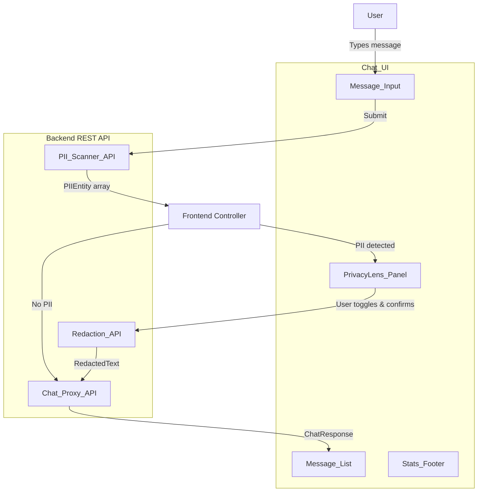

# Design Document: Chat Frontend PII Panel

## Overview

The Chat Frontend PII Panel is a web-based chat interface built with TypeScript that integrates with the existing PII Redaction Filter backend. It provides a real-time chat experience with inline PII highlighting, a slide-out "PrivacyLens" side panel for reviewing and selectively redacting detected PII, and session-level statistics tracking.

The frontend communicates with three backend REST API endpoints — PII_Scanner_API, Redaction_API, and Chat_Proxy_API — that wrap the existing `scan()`, `redact()`, and `ChatProxyImpl.processRequest()` functions. The user composes a message, the frontend scans it for PII, highlights detected entities inline, opens the PrivacyLens panel for review, and sends the message with user-selected redactions applied.

### Key Design Decisions

- **TypeScript** for the frontend to share types with the existing backend (`PIIEntity`, `PIIType`, `RedactionResult`, etc.).
- **Component-based architecture** with clear separation: ChatWindow (message list + input), PrivacyLensPanel (PII review), and an API service layer.
- **Client-side PII highlighting** using the entity positions returned by the backend scanner — no duplicate regex logic on the frontend.
- **Selective redaction model** — all PII toggles default to enabled (redact), but users can disable individual items before sending. Only enabled entities are sent to the Redaction_API.
- **Session storage** for PII stats counter — resets on new browser session per requirements.
- **REST API integration** — three POST endpoints wrapping existing backend functions, keeping the proven scanning/redaction logic server-side.

## Architecture



### Data Flow

1. User types a message in **Message_Input** and submits (Enter or click send).
2. Frontend POSTs the text to **PII_Scanner_API**, receives `PIIEntity[]`.
3. If no PII detected → message is sent directly to **Chat_Proxy_API**, response displayed.
4. If PII detected → message text is rendered with **PII_Highlights** inline, **PrivacyLens_Panel** slides open showing PII_Item_Cards.
5. User reviews PII items, toggles redaction on/off per item, then confirms send.
6. Frontend filters entities to only those with enabled toggles, POSTs to **Redaction_API** with text + selected entities.
7. Redacted text is forwarded to **Chat_Proxy_API** for downstream processing.
8. Assistant reply is displayed as a new Message_Bubble. **Stats_Footer** increments.

## Components and Interfaces

### ChatWindow

The main container component managing the message list and input area.

```typescript
interface ChatMessage {
  id: string;
  role: 'user' | 'assistant';
  text: string;
  piiEntities?: PIIEntity[];       // detected entities for highlighting
  redactedText?: string;           // text after user-selected redaction
  timestamp: Date;
  isError?: boolean;
}

interface ChatWindowState {
  messages: ChatMessage[];
  isLoading: boolean;
  inputText: string;
}
```

### MessageBubble

Renders a single message with optional inline PII highlighting.

```typescript
interface MessageBubbleProps {
  message: ChatMessage;
  alignment: 'left' | 'right';     // left for assistant, right for user
}
```

- User messages with PII entities render `PII_Highlight` spans using entity positions.
- Assistant messages render plain text.
- Error messages render with a distinct error style.

### PIIHighlighter

Pure function that segments message text into highlighted and plain spans based on entity positions.

```typescript
interface TextSegment {
  text: string;
  entity?: PIIEntity;
  isHighlighted: boolean;
}

function segmentText(text: string, entities: PIIEntity[]): TextSegment[];
```

- Iterates through sorted entities, splitting text into alternating plain/highlighted segments.
- Each highlighted segment carries its entity reference for color mapping.

### PII Color Map

```typescript
const PII_COLOR_MAP: Record<PIIType, string> = {
  EMAIL: '#DBEAFE',      // blue
  PHONE: '#FFEDD5',      // orange
  SSN: '#FEE2E2',        // red
  CREDIT_CARD: '#F3E8FF', // purple
  ADDRESS: '#DCFCE7',    // green
  FILE_PATH: '#F3F4F6',  // gray
};
```

### PrivacyLensPanel

The slide-out side panel for PII review and selective redaction.

```typescript
interface PIIItemState {
  entity: PIIEntity;
  redactionEnabled: boolean;
}

interface PrivacyLensPanelProps {
  items: PIIItemState[];
  onToggleRedaction: (index: number) => void;
  onAutoRedactAll: () => void;
  onConfirmSend: () => void;
  onClose: () => void;
  sessionStats: number;
}
```

### PIIItemCard

A single PII entity card within the PrivacyLens panel.

```typescript
type RiskLevel = 'High Risk' | 'Medium Risk' | 'Low Risk';

function getRiskLevel(type: PIIType): RiskLevel;
function getPIIIcon(type: PIIType): string;
```

Risk level mapping:
- **High Risk**: `SSN`, `CREDIT_CARD`
- **Medium Risk**: `EMAIL`, `PHONE`
- **Low Risk**: `ADDRESS`, `FILE_PATH`

### API Service Layer

```typescript
interface PIIScanResponse {
  entities: PIIEntity[];
}

interface RedactionRequest {
  text: string;
  entities: PIIEntity[];
}

interface APIService {
  scanForPII(text: string): Promise<PIIEntity[]>;
  redactText(text: string, entities: PIIEntity[]): Promise<RedactionResult>;
  sendMessage(request: ChatRequest): Promise<ChatResponse>;
}
```

- Each method wraps a `fetch()` call to the corresponding backend endpoint.
- Non-200 responses throw typed errors for the UI to handle.

### Backend REST Endpoints

| Endpoint | Method | Request Body | Response Body |
|----------|--------|-------------|---------------|
| `/api/scan` | POST | `{ text: string }` | `PIIEntity[]` |
| `/api/redact` | POST | `{ text: string, entities: PIIEntity[] }` | `RedactionResult` |
| `/api/chat` | POST | `ChatRequest` | `ChatResponse` |

## Data Models

### Shared Types (reused from backend `types.ts`)

The frontend imports or mirrors these types from the backend:

- `PIIType` — `'EMAIL' | 'PHONE' | 'SSN' | 'CREDIT_CARD' | 'ADDRESS' | 'FILE_PATH'`
- `PIIEntity` — `{ type, matchedText, startIndex, endIndex }`
- `RedactionResult` — `{ redactedText, redactions }`
- `ChatRequest` — `{ prompt, pdfAttachment? }`
- `ChatResponse` — `{ reply, redactionReport, notification, blocked, error? }`

### Frontend-Specific Models

```typescript
/** State for a PII item in the PrivacyLens panel */
interface PIIItemState {
  entity: PIIEntity;
  redactionEnabled: boolean;  // defaults to true
}

/** A chat message in the conversation */
interface ChatMessage {
  id: string;
  role: 'user' | 'assistant';
  text: string;
  piiEntities?: PIIEntity[];
  redactedText?: string;
  timestamp: Date;
  isError?: boolean;
}

/** Session statistics stored in sessionStorage */
interface SessionStats {
  itemsProtected: number;
}
```

### Risk Level Classification

```typescript
const RISK_LEVEL_MAP: Record<PIIType, RiskLevel> = {
  SSN: 'High Risk',
  CREDIT_CARD: 'High Risk',
  EMAIL: 'Medium Risk',
  PHONE: 'Medium Risk',
  ADDRESS: 'Low Risk',
  FILE_PATH: 'Low Risk',
};
```


## Correctness Properties

*A property is a characteristic or behavior that should hold true across all valid executions of a system — essentially, a formal statement about what the system should do. Properties serve as the bridge between human-readable specifications and machine-verifiable correctness guarantees.*

### Property 1: Text Segmentation Preserves Original Text

*For any* message text and any valid sorted array of non-overlapping PIIEntity positions within that text, the `segmentText` function SHALL produce an array of TextSegments where: (a) concatenating all segment `.text` values reproduces the original message text exactly, (b) each segment marked `isHighlighted: true` has `.text` equal to the corresponding entity's `matchedText`, and (c) when the entity array is empty, the result is a single unhighlighted segment containing the full text.

**Validates: Requirements 3.1, 3.3, 3.4**

### Property 2: Selective Redaction Filtering

*For any* array of PIIItemState objects with arbitrary `redactionEnabled` boolean values, filtering to only enabled items SHALL produce a result containing exactly the entities where `redactionEnabled === true`, preserving their order, and the count of filtered entities SHALL equal the number of items with `redactionEnabled === true` in the input.

**Validates: Requirements 6.1, 6.2, 7.1**

### Property 3: Auto-Redact Enables All Toggles

*For any* array of PIIItemState objects with arbitrary `redactionEnabled` boolean values, applying the autoRedactAll operation SHALL produce an array of the same length where every item has `redactionEnabled === true`, and all entity references remain unchanged.

**Validates: Requirements 6.3**

### Property 4: Session Stats Accumulation

*For any* sequence of non-negative integer redaction counts, the cumulative session stats counter SHALL equal the sum of all counts in the sequence after processing each one, starting from zero.

**Validates: Requirements 8.1, 8.2, 8.3**

## Error Handling

### PII_Scanner_API Errors
- Non-200 response: Display an error notification in the Chat_UI. Allow the user to retry scanning by resubmitting the message. Do not open the PrivacyLens_Panel.

### Redaction_API Errors
- Non-200 response: Display an error notification. Prevent the message from being sent. Keep the PrivacyLens_Panel open so the user can retry.

### Chat_Proxy_API Errors
- Non-200 response or `error` field in ChatResponse: Display an error Message_Bubble in the Message_List with the error description.
- `blocked: true` in ChatResponse: Display a notification that the message was blocked by privacy rules.

### Network Errors
- Fetch failures (network down, timeout): Display a generic connection error notification. Allow retry.

### Empty/Invalid Input
- Empty or whitespace-only input: Send button remains disabled. No API calls made.

## Testing Strategy

### Property-Based Tests (fast-check)

The project uses [fast-check](https://github.com/dubzzz/fast-check) for property-based testing. Each correctness property maps to a single property-based test with a minimum of 100 iterations.

**Test tagging format**: `Feature: chat-frontend-pii-panel, Property {N}: {title}`

| Property | Test Description | Generator Strategy |
|----------|-----------------|-------------------|
| 1 | Text Segmentation Preserves Original Text | Generate random strings (1–500 chars) and random non-overlapping entity spans within them. Verify segment concatenation equals original text, highlighted segments match entity text. |
| 2 | Selective Redaction Filtering | Generate arrays of 1–20 PIIItemState objects with random `redactionEnabled` booleans. Verify filtered output contains exactly the enabled entities. |
| 3 | Auto-Redact Enables All Toggles | Generate arrays of 1–20 PIIItemState objects with random toggle states. Apply autoRedactAll, verify all toggles are true and entities unchanged. |
| 4 | Session Stats Accumulation | Generate sequences of 1–50 non-negative integers. Apply each as a redaction count increment. Verify running total equals sum. |

### Unit Tests (example-based)

- MessageBubble renders user messages right-aligned, assistant messages left-aligned (Req 1.1, 1.2)
- MessageBubble applies distinct background colors per role (Req 1.4)
- Message_List auto-scrolls on new message (Req 1.3)
- Send button disabled when input is empty (Req 2.4)
- Loading indicator shown during API processing (Req 2.5)
- PII color map returns distinct colors for each PIIType (Req 3.2)
- getRiskLevel returns correct risk level for each PIIType (Req 5.3)
- PII_Item_Card displays icon, label, matched text, and toggle defaulting to enabled (Req 5.1, 5.2, 5.4, 5.5)
- PrivacyLens_Panel opens when PII detected, stays closed when none (Req 4.1, 4.6)
- Panel header shows correct count format (Req 4.2)
- Panel subtitle shows static text (Req 4.3)
- Panel renders one card per entity (Req 4.4)
- Close button hides panel (Req 4.5)
- Toggled-off highlight uses muted style (Req 6.4)
- No-PII message sends directly without panel (Req 7.5)
- Assistant reply added to message list (Req 7.3)
- Error response displayed as error bubble (Req 7.4)
- Stats footer shows "{count} items protected today" format (Req 8.1)
- Stats reset to zero on new session (Req 8.3)
- Scan API error shows notification with retry (Req 9.4)
- Redaction API error prevents send (Req 9.5)

### Integration Tests

- Full flow: compose → scan → highlight → toggle → redact → send → display reply (Req 2.2, 7.1, 7.2, 7.3)
- API contract: scan endpoint returns PIIEntity[] (Req 9.1)
- API contract: redact endpoint returns RedactionResult (Req 9.2)
- API contract: chat endpoint returns ChatResponse (Req 9.3)
- Responsive layout: side-by-side at ≥1024px, overlay at <1024px (Req 10.1, 10.2)
- Fixed input at bottom of viewport (Req 10.3)
