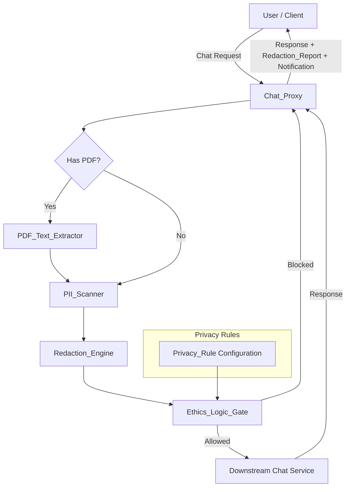

# Design Document: PII Redaction Filter

## Overview

The PII Redaction Filter is a middleware layer implemented in TypeScript/Node.js that intercepts chat messages before they reach a downstream chat service. It provides a processing pipeline that scans text (from both user prompts and PDF attachments) for Personally Identifiable Information, redacts or blocks messages based on configurable privacy rules, notifies users of actions taken, and generates audit reports. PII types include email addresses, phone numbers, SSNs, credit card numbers, physical addresses, and file system paths — the latter addressing the common scenario where developers paste terminal output into chat applications, inadvertently leaking directory structure and usernames.

The system is designed as a composable pipeline of discrete components — PII_Scanner, Redaction_Engine, Ethics_Logic_Gate, Notification_Service, PDF_Text_Extractor — orchestrated by a Chat_Proxy middleware. Each component has a well-defined interface, enabling independent testing and replacement.

### Key Design Decisions

- **TypeScript** chosen for strong typing, which helps model PII entity types and pipeline stages safely.
- **Regex-based PII detection** for the initial implementation — provides deterministic, fast scanning without external ML dependencies. Patterns are modular and can be extended.
- **Synchronous pipeline** — the Chat_Proxy processes scan → redact → gate → notify in sequence per request, simplifying error handling and ensuring the Ethics_Logic_Gate can halt processing before any data leaves the system.
- **pdf-parse library** for PDF text extraction — lightweight, pure-JS, no native dependencies.

## Architecture

The system follows a pipeline architecture where each incoming request flows through a series of processing stages.



### Pipeline Flow

1. **Chat_Proxy** receives the incoming request.
2. If a PDF is attached, **PDF_Text_Extractor** extracts text from the document.
3. **PII_Scanner** analyzes the text prompt (and extracted PDF text, if any) for PII entities.
4. **Redaction_Engine** replaces detected PII with type-specific placeholders.
5. **Ethics_Logic_Gate** evaluates detected PII against privacy rules — blocks or allows.
6. If allowed, the redacted message is forwarded to the downstream chat service.
7. **Notification_Service** constructs user-facing notifications about actions taken.
8. **Chat_Proxy** returns the response, notification, and Redaction_Report to the caller.

## Components and Interfaces

### PII_Scanner

Analyzes input text and returns a list of detected PII entities with their types, matched text, and positions.

```typescript
interface PIIEntity {
  type: PIIType;
  matchedText: string;
  startIndex: number;
  endIndex: number;
}

type PIIType = 'EMAIL' | 'PHONE' | 'SSN' | 'CREDIT_CARD' | 'ADDRESS' | 'FILE_PATH';

interface PIIScanner {
  scan(text: string): PIIEntity[];
}
```

- Uses an ordered set of regex patterns, one per PII type.
- Skips matches that overlap with Redacted_Placeholder tokens (e.g., `[EMAIL_REDACTED]`).
- Returns entities sorted by `startIndex`.
- For file path detection, uses separate patterns for each path style:
  - **Unix absolute**: Matches `/` followed by one or more path components (letters, digits, dots, hyphens, underscores, spaces) separated by `/`. Does not match URLs (skips matches preceded by `://`).
  - **Unix home-relative**: Matches `~/` followed by one or more path components.
  - **Windows drive**: Matches a drive letter followed by `:\` and one or more path components separated by `\`.
  - **Windows UNC**: Matches `\\` followed by a server name and one or more share/folder components separated by `\`.
- File path patterns exclude single `/`, lone `~`, and URL patterns (`http://`, `https://`, `ftp://`).

### Redaction_Engine

Replaces detected PII entities in the original text with type-specific placeholders.

```typescript
interface RedactionResult {
  redactedText: string;
  redactions: RedactionAction[];
}

interface RedactionAction {
  entityType: PIIType;
  originalText: string;
  placeholder: string;
  startIndex: number;
  endIndex: number;
}

interface RedactionEngine {
  redact(text: string, entities: PIIEntity[]): RedactionResult;
}
```

- Placeholder mapping: `EMAIL` → `[EMAIL_REDACTED]`, `PHONE` → `[PHONE_REDACTED]`, `SSN` → `[SSN_REDACTED]`, `CREDIT_CARD` → `[CREDIT_CARD_REDACTED]`, `ADDRESS` → `[ADDRESS_REDACTED]`, `FILE_PATH` → `[FILE_PATH_REDACTED]`.
- Processes entities in reverse order of `startIndex` to preserve character positions during replacement.
- Preserves all non-PII text unchanged.

### Ethics_Logic_Gate

Evaluates detected PII against privacy rules and decides whether to block or allow the message.

```typescript
interface GateResult {
  allowed: boolean;
  blockedTypes: PIIType[];
  reason: string | null;
}

interface EthicsLogicGate {
  evaluate(entities: PIIEntity[], rules: PrivacyRuleConfig): GateResult;
}
```

- If any entity matches a "block" rule, the entire message is blocked.
- If all entities match "redact" rules (or no rules are configured), the message is allowed.
- On internal error, defaults to blocking and logs the error.

### Notification_Service

Constructs user-facing notifications about PII actions taken.

```typescript
interface PIINotification {
  type: 'redaction' | 'block';
  message: string;
  details: Record<PIIType, number>; // count per type
}

interface NotificationService {
  createRedactionNotification(redactions: RedactionAction[]): PIINotification;
  createBlockNotification(blockedTypes: PIIType[], reason: string): PIINotification;
}
```

- Notifications are returned synchronously as part of the response — no async delivery.
- No notification is generated when zero PII entities are detected.

### PDF_Text_Extractor

Extracts readable text from PDF documents.

```typescript
interface PDFExtractionResult {
  text: string;
  pageCount: number;
  extractable: boolean;
  error?: string;
}

interface PDFTextExtractor {
  extract(pdfBuffer: Buffer): Promise<PDFExtractionResult>;
}
```

- Supports up to 50 pages; rejects documents exceeding this limit.
- Returns `extractable: false` for image-only PDFs (empty text result).
- Throws on corrupted or password-protected PDFs with a descriptive error.
- Must complete within 3 seconds for a 50-page document.

### Chat_Proxy

Orchestrates the full pipeline and generates the Redaction_Report.

```typescript
interface ChatRequest {
  prompt: string;
  pdfAttachment?: Buffer;
}

interface ChatResponse {
  reply: string | null;
  redactionReport: RedactionReport;
  notification: PIINotification | null;
  blocked: boolean;
  error?: string;
}

interface ChatProxy {
  processRequest(request: ChatRequest, rules: PrivacyRuleConfig): Promise<ChatResponse>;
}
```

## Data Models

### PII Types and Placeholders

```typescript
const PLACEHOLDER_MAP: Record<PIIType, string> = {
  EMAIL: '[EMAIL_REDACTED]',
  PHONE: '[PHONE_REDACTED]',
  SSN: '[SSN_REDACTED]',
  CREDIT_CARD: '[CREDIT_CARD_REDACTED]',
  ADDRESS: '[ADDRESS_REDACTED]',
  FILE_PATH: '[FILE_PATH_REDACTED]',
};
```

### Privacy Rule Configuration

```typescript
type PrivacyAction = 'block' | 'redact';

interface PrivacyRuleConfig {
  rules: Record<PIIType, PrivacyAction>;
}
```

- If a PII type is absent from the config, it defaults to `'redact'`.
- Validation at startup rejects configs referencing unsupported PII types.

### Redaction Report

```typescript
interface RedactionReport {
  messageHash: string;          // SHA-256 hash of the original message
  detectedCounts: Record<PIIType, number>;
  actions: ReportAction[];
  timestamp: string;            // ISO 8601
  pdfStatus?: 'processed' | 'unprocessable' | 'error' | 'none';
}

interface ReportAction {
  entityType: PIIType;
  action: 'redacted' | 'blocked' | 'none';
}
```

- `messageHash` is a SHA-256 hash of the original text (never stores the raw text).
- When no PII is detected, `detectedCounts` has zero values and `actions` contains a single entry with action `'none'`.


## Correctness Properties

*A property is a characteristic or behavior that should hold true across all valid executions of a system — essentially, a formal statement about what the system should do. Properties serve as the bridge between human-readable specifications and machine-verifiable correctness guarantees.*

### Property 1: PII Detection Accuracy

*For any* valid PII entity of a supported type (email, phone, SSN, credit card, address, file path) embedded at any position within arbitrary surrounding text, the PII_Scanner SHALL detect it and return a PII_Entity with the correct type, where `matchedText` equals the original PII string and `text.substring(startIndex, endIndex)` equals `matchedText`.

**Validates: Requirements 1.2, 1.3, 8.1, 8.2, 8.3, 8.4, 10.1, 10.2, 10.3, 10.4**

### Property 2: No False Positives on Clean Text

*For any* text string that contains no valid PII patterns (no email addresses, phone numbers, SSNs, credit card numbers, or addresses), the PII_Scanner SHALL return an empty list of PII entities.

**Validates: Requirements 1.4**

### Property 3: Correct Redaction with Type-Specific Placeholders

*For any* text containing one or more detected PII entities (including multiple entities of the same type), the Redaction_Engine SHALL replace each entity with its type-specific placeholder (`[EMAIL_REDACTED]`, `[PHONE_REDACTED]`, `[SSN_REDACTED]`, `[CREDIT_CARD_REDACTED]`, `[ADDRESS_REDACTED]`), and the redacted text SHALL contain exactly as many placeholders of each type as there were detected entities of that type.

**Validates: Requirements 2.1, 2.2, 2.4**

### Property 4: Non-PII Text Preservation

*For any* text and set of detected PII entities, after redaction, all characters in the original text that were not part of any PII entity span SHALL remain unchanged in the redacted output at their corresponding positions.

**Validates: Requirements 2.3**

### Property 5: Redaction Round-Trip

*For any* valid input text, scanning for PII, redacting all detected entities, and then scanning the redacted output again SHALL yield zero PII entities. This ensures that redacted placeholders are never themselves flagged as PII and that redaction is complete.

**Validates: Requirements 2.5, 8.5**

### Property 6: Block Rule Enforcement

*For any* set of detected PII entities and any Privacy_Rule configuration where at least one detected entity's type is mapped to "block", the Ethics_Logic_Gate SHALL return `allowed: false`, and the `blockedTypes` array SHALL contain exactly the PII types that matched "block" rules, and `reason` SHALL be non-null.

**Validates: Requirements 3.2, 3.3**

### Property 7: Redact-Only Rules Allow Message

*For any* set of detected PII entities and any Privacy_Rule configuration (including empty configurations) where no detected entity's type is mapped to "block" (missing types default to "redact"), the Ethics_Logic_Gate SHALL return `allowed: true`.

**Validates: Requirements 3.4, 3.5, 7.2**

### Property 8: Redaction Notification Correctness

*For any* non-empty list of redaction actions, the Notification_Service SHALL produce a notification of type `'redaction'` where the `details` record contains the correct count for each redacted PII type.

**Validates: Requirements 4.1**

### Property 9: Block Notification Correctness

*For any* gate result where `allowed` is false, the Notification_Service SHALL produce a notification of type `'block'` that lists exactly the PII types present in `blockedTypes`.

**Validates: Requirements 4.2**

### Property 10: No Notification for Clean Messages

*For any* text containing no PII entities, processing through the pipeline SHALL produce a null notification (no PII-related notification is generated).

**Validates: Requirements 4.4**

### Property 11: Redaction Report Structure

*For any* processed message, the generated Redaction_Report SHALL contain: a `messageHash` that is a valid SHA-256 hex string of the original message, `detectedCounts` matching the actual count of detected entities per type, `actions` entries matching the action taken for each entity, and a valid ISO 8601 `timestamp`.

**Validates: Requirements 6.1**

### Property 12: Privacy Rule Configuration Validation

*For any* configuration object, the Ethics_Logic_Gate SHALL accept it if and only if all keys in the rules map are supported PII types (including `FILE_PATH`). Configurations referencing unsupported PII type strings SHALL be rejected.

**Validates: Requirements 7.1, 7.3**

### Property 13: File System Path Detection Accuracy

*For any* valid file system path of a supported style (Unix absolute, Unix home-relative, Windows drive, Windows UNC) containing valid path characters (letters, digits, dots, hyphens, underscores, spaces) embedded at any position within arbitrary surrounding text, the PII_Scanner SHALL detect it and return a PII_Entity with type `FILE_PATH`, where `matchedText` equals the original path string and `text.substring(startIndex, endIndex)` equals `matchedText`.

**Validates: Requirements 10.1, 10.2, 10.3, 10.4, 10.5, 10.8**

### Property 14: No False Positives on Non-Path Patterns

*For any* text containing single forward slashes, lone tildes, URL patterns (e.g., `https://example.com/path`), or plain words without path separators, the PII_Scanner SHALL not return any PII_Entity with type `FILE_PATH`.

**Validates: Requirements 10.6**

### Property 15: File Path Redaction Round-Trip

*For any* valid input text containing file system paths, scanning for PII, redacting all detected entities (including file paths with `[FILE_PATH_REDACTED]`), and then scanning the redacted output again SHALL yield zero PII entities of type `FILE_PATH`. This ensures that the `[FILE_PATH_REDACTED]` placeholder is not itself flagged as a file path.

**Validates: Requirements 10.7, 2.5**

## Error Handling

### PII_Scanner Errors
- If the scanner encounters an unexpected regex failure, it logs the error and returns an empty entity list (fail-open for scanning, but the Ethics_Logic_Gate fail-safe catches this — see below).

### Redaction_Engine Errors
- If entity positions are out of bounds for the given text, the engine throws an `InvalidEntityError`. The Chat_Proxy catches this and returns an error response.

### Ethics_Logic_Gate Errors
- On any internal error during rule evaluation, the gate defaults to **blocking** the message and logs the error (Requirement 3.6). This is a fail-safe — no unscanned content passes through.

### PDF_Text_Extractor Errors
- **Corrupted PDF**: Throws `PDFCorruptedError` with a descriptive message. Chat_Proxy returns an error response to the user (Requirement 9.6).
- **Password-protected PDF**: Throws `PDFPasswordProtectedError`. Chat_Proxy returns an error response explaining the failure.
- **Image-only PDF (no extractable text)**: Returns `extractable: false` with empty text. Chat_Proxy flags as `"unprocessable"` in the Redaction_Report (Requirement 9.3).
- **PDF exceeds 50 pages**: Throws `PDFPageLimitError`. Chat_Proxy returns an error response.
- **Timeout (>3 seconds)**: The extractor is wrapped in a timeout; if exceeded, throws `PDFTimeoutError`.

### Chat_Proxy Errors
- **Downstream service unavailable**: Returns an error response to the user with a descriptive message. No automatic retry (Requirement 5.5).
- **Pipeline component failure**: Any unhandled error from a pipeline component results in the message being blocked (fail-safe) and an error response returned to the user.

## Testing Strategy

### Property-Based Tests (fast-check)

The project will use [fast-check](https://github.com/dubzzz/fast-check) for property-based testing in TypeScript. Each correctness property maps to a single property-based test with a minimum of 100 iterations.

**Test tagging format**: `Feature: pii-redaction-filter, Property {N}: {title}`

| Property | Test Description | Generator Strategy |
|----------|-----------------|-------------------|
| 1 | PII Detection Accuracy | Generate random PII values per type (valid emails, phones, SSNs, credit cards) embedded in random surrounding text |
| 2 | No False Positives | Generate random alphanumeric/word strings that avoid PII patterns |
| 3 | Correct Redaction | Generate text with 1-5 embedded PII entities of mixed types, verify placeholder counts |
| 4 | Non-PII Preservation | Generate text with known PII positions, verify non-PII segments unchanged after redaction |
| 5 | Redaction Round-Trip | Generate arbitrary text (with and without PII), scan → redact → scan, assert zero entities |
| 6 | Block Rule Enforcement | Generate random PII entity lists + rule configs with ≥1 "block", verify gate blocks |
| 7 | Redact-Only Allows | Generate random PII entity lists + rule configs with all "redact" (or empty), verify gate allows |
| 8 | Redaction Notification | Generate random RedactionAction lists, verify notification type and counts |
| 9 | Block Notification | Generate random GateResult with allowed=false, verify notification type and blocked types |
| 10 | No Notification for Clean | Generate non-PII text, process, verify null notification |
| 11 | Report Structure | Generate random messages, process, verify report hash/counts/actions/timestamp |
| 12 | Config Validation | Generate configs with valid and invalid PII type keys (including FILE_PATH), verify accept/reject |
| 13 | File Path Detection Accuracy | Generate random valid file paths (Unix absolute, home-relative, Windows drive, UNC) with valid path characters embedded in surrounding text, assert scanner detects them with type FILE_PATH |
| 14 | No False Positives on Non-Path Patterns | Generate single slashes, lone tildes, URLs, and plain words, assert scanner returns no FILE_PATH entities |
| 15 | File Path Redaction Round-Trip | Generate text with file paths, scan → redact → scan, assert zero FILE_PATH entities on second scan |

### Unit Tests (example-based)

- Ethics_Logic_Gate internal error → blocks message (Requirement 3.6)
- Downstream service unavailable → error response, no retry (Requirement 5.5)
- Corrupted PDF → error response (Requirement 9.6)
- Password-protected PDF → error response (Requirement 9.6)
- Image-only PDF → empty text, "unprocessable" flag (Requirement 9.3)
- PDF exceeding 50 pages → rejection (Requirement 9.2)
- No PII detected → report with zero counts and "none" action (Requirement 6.3)

### Integration Tests

- Pipeline ordering: Scanner runs before Redaction_Engine, before Ethics_Logic_Gate (Requirement 5.2)
- PDF extraction runs before scanning when PDF is attached (Requirement 5.2)
- Blocked message does not contact downstream service (Requirement 5.4)
- Allowed message forwards redacted text and returns response + report (Requirement 5.3)
- Combined text + PDF scanning produces single merged report (Requirement 9.8)
- Performance: Scanner processes 10,000 chars in < 500ms (Requirement 1.5)
- Performance: PDF extractor processes 50 pages in < 3 seconds (Requirement 9.7)
