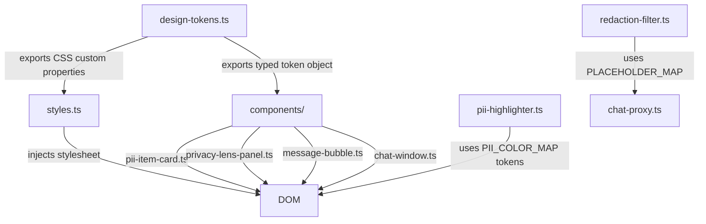
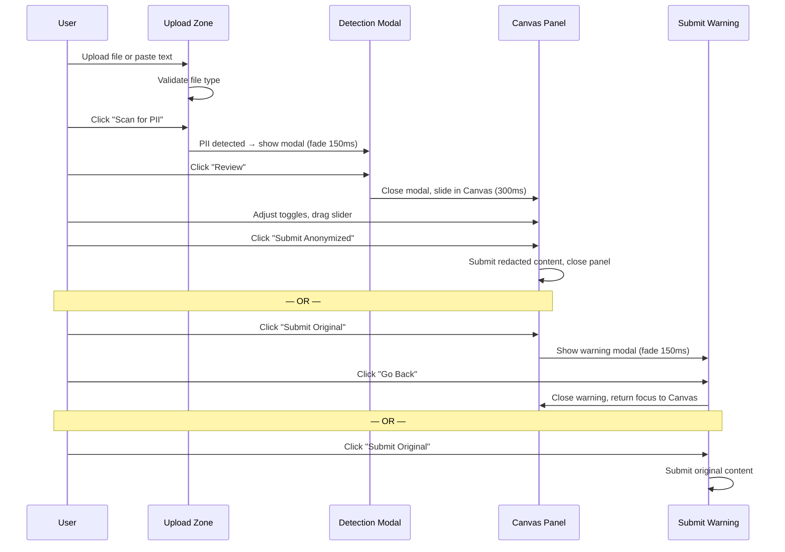

# Design Document — Privacy Lens Design System

## Overview

Privacy Lens is a standalone web page that intercepts user-submitted content (PDF, image, or plain text), scans it for PII, and guides the user through a redaction review flow before forwarding to a downstream AI chat service. This document specifies the complete design system: design tokens, component anatomy, interaction patterns, layout, copy guidelines, and accessibility implementation.

The product metaphor is a magnifying glass revealing fine print — careful, precise, and respectful. The tone is firm but kind: serious without being alarming, human without being overly friendly. Every design decision reinforces one moment of informed pause.

### Research Summary

The design system is built on three foundational references:

- **WCAG 2.1 AA** ([w3.org/TR/WCAG21](https://www.w3.org/TR/WCAG21/)) — contrast ratios (4.5:1 normal text, 3:1 large text/UI), focus indicators, keyboard operability, ARIA patterns.
- **Linden Hill** (Google Fonts) — a classical serif typeface with strong readability at body sizes. Fallback: `Georgia, serif`.
- **CSS Custom Properties** — all tokens are implemented as CSS custom properties (`--token-name`) for runtime accessibility and theming consistency.

The existing implementation in `src/frontend/` uses inline styles with hardcoded values. This design system replaces those with a token-based approach while preserving the established component structure.

---

## Architecture

The design system is implemented as a TypeScript module (`src/frontend/design-tokens.ts`) that exports a typed token object and a `getDesignSystemCSS()` function that injects all tokens as CSS custom properties into the document. Components reference tokens via CSS custom properties rather than hardcoded values.



### Component Hierarchy

```
App Layout (styles.ts)
├── Upload Zone (upload-zone.ts)          — file/text input, drag-drop
├── Detection Modal (detection-modal.ts)  — PII found notification
├── Scrim (shared)                        — semi-transparent overlay
├── Canvas Panel (privacy-lens-panel.ts)  — slide-in review panel
│   ├── Canvas Header                     — count + download + close
│   ├── Before/After Slider               — comparison view
│   ├── PII Item Card List (pii-item-card.ts)
│   └── Canvas Footer                     — Submit Anonymized / Submit Original
└── Submit Original Warning (submit-warning.ts) — destructive action confirmation
```

---

## Components and Interfaces

### 4.1 Design Token Module

**File:** `src/frontend/design-tokens.ts`

Exports a `DesignTokens` typed object and a `getDesignSystemCSS(): string` function that returns a `<style>` block declaring all tokens as CSS custom properties on `:root`.

```typescript
export interface DesignTokens {
  color: ColorTokens;
  typography: TypographyTokens;
  spacing: SpacingTokens;
  radius: RadiusTokens;
  shadow: ShadowTokens;
  zIndex: ZIndexTokens;
  motion: MotionTokens;
}
```

### 4.2 Upload Zone

**File:** `src/frontend/components/upload-zone.ts`

**Props:**
```typescript
interface UploadZoneProps {
  isDragActive: boolean;
  acceptedFile: { name: string; type: string } | null;
  textValue: string;
  errorMessage: string | null;
}
```

**States:** idle | drag-active | file-accepted | error | text-entered

**ARIA:** `role="region"`, `aria-label="Upload content for PII scanning"`. File input: `aria-label="Upload PDF or image file"`. Text area: `aria-label="Paste plain text"`. Error: `aria-live="polite"` region.

### 4.3 Detection Modal

**File:** `src/frontend/components/detection-modal.ts`

**Props:**
```typescript
interface DetectionModalProps {
  piiCount: number;
  isVisible: boolean;
}
```

**States:** hidden | visible

**ARIA:** `role="dialog"`, `aria-modal="true"`, `aria-labelledby="detection-modal-title"`, `aria-describedby="detection-modal-body"`. Focus trap on open; restore focus to triggering element on close.

### 4.4 Canvas Panel

**File:** `src/frontend/components/privacy-lens-panel.ts` (existing, to be updated)

**Props:**
```typescript
interface PrivacyLensPanelProps {
  items: PIIItemState[];
  sessionStats: number;
  isOpen: boolean;
  contentType: 'text' | 'image' | 'pdf';
  originalContent: string;       // text or data URL
  redactedContent: string;       // text or data URL
}
```

**States:** closed | open | open-narrow (< 1024px)

**ARIA:** `role="complementary"`, `aria-label="PII Review Panel"`. Close button: `aria-label="Close review panel"`. Slider: `role="slider"`, `aria-label="Compare original and redacted content"`, `aria-valuemin="0"`, `aria-valuemax="100"`, `aria-valuenow` updated on drag.

### 4.5 PII Item Card

**File:** `src/frontend/components/pii-item-card.ts` (existing, to be updated)

**Props:**
```typescript
interface PIIItemCardProps {
  item: PIIItemState;
  index: number;
}
```

**States:** redact-enabled | redact-disabled

**ARIA:** Toggle input `aria-label` = `"Redact ${type} — ${enabled ? 'enabled' : 'disabled'}"`. Risk badge: `aria-label="Risk level: ${riskLevel}"`.

### 4.6 Submit Original Warning

**File:** `src/frontend/components/submit-warning.ts`

**Props:**
```typescript
interface SubmitWarningProps {
  isVisible: boolean;
  piiCount: number;
}
```

**States:** hidden | visible

**ARIA:** `role="alertdialog"`, `aria-modal="true"`, `aria-labelledby="warning-title"`, `aria-describedby="warning-body"`. Focus trap; restore focus to Canvas on close.

---

## Data Models

### Token Types

```typescript
interface ColorTokens {
  // Background & Surface
  bgBase: string;          // page background
  bgSurface: string;       // card/panel surface
  bgSurfaceRaised: string; // elevated surface (modal)

  // Text
  textPrimary: string;
  textSecondary: string;
  textDisabled: string;

  // Border
  borderDefault: string;
  borderSubtle: string;

  // Alert / Destructive
  coralAlert: string;      // muted coral — PII alerts, destructive states
  coralAlertLight: string; // tinted coral background for alert areas

  // Severity
  severityHigh: string;    // High Risk (SSN, CREDIT_CARD)
  severityMedium: string;  // Medium Risk (EMAIL, PHONE)
  severityLow: string;     // Low Risk (ADDRESS, FILE_PATH)

  // Interactive States
  interactiveHover: string;
  interactiveFocus: string;
  interactiveActive: string;

  // Scrim
  scrim: string;           // rgba overlay
}

interface TypographyTokens {
  fontFamilyPrimary: string;
  fontFamilyFallback: string;
  // Scale (font-size in px)
  sizeHeading: number;     // 28px
  sizeSubheading: number;  // 20px
  sizeBody: number;        // 16px
  sizeLabel: number;       // 13px
  sizeCaption: number;     // 11px
  // Weights
  weightRegular: number;   // 400
  weightBold: number;      // 700
  // Line heights (unitless ratio)
  lineHeightHeading: number;    // 1.25
  lineHeightSubheading: number; // 1.3
  lineHeightBody: number;       // 1.6
  lineHeightLabel: number;      // 1.4
  lineHeightCaption: number;    // 1.4
  // Letter spacing (em)
  letterSpacingHeading: string; // -0.01em
  letterSpacingLabel: string;   // 0.02em
}

interface SpacingTokens {
  xs: number;   // 4px
  sm: number;   // 8px
  md: number;   // 12px
  base: number; // 16px
  lg: number;   // 24px
  xl: number;   // 32px
  xxl: number;  // 48px
}

interface RadiusTokens {
  small: number;  // 4px
  medium: number; // 8px
  large: number;  // 12px
  pill: number;   // 9999px
}

interface ShadowTokens {
  card: string;   // card elevation
  panel: string;  // Canvas panel elevation
  modal: string;  // modal elevation
}

interface ZIndexTokens {
  base: number;   // 0
  canvas: number; // 100
  scrim: number;  // 200
  modal: number;  // 300
}

interface MotionTokens {
  canvasSlide: string;  // 300ms ease
  modalFade: string;    // 150ms ease
  scrimFade: string;    // 150ms ease
  toggleColor: string;  // 200ms ease
}
```

### PII Highlight Segment Model

```typescript
interface TextSegment {
  text: string;
  entity?: PIIEntity;
  isHighlighted: boolean;
}
```

The `pii-highlighter.ts` module segments input text into `TextSegment[]` by splitting at entity boundaries (sorted by `startIndex`), then renders each segment as a `<span>` — plain for non-PII, styled with background colour and underline for PII.

---


## Design Token Specifications

### Colour Tokens

All values are CSS colour strings. Light mode only.

| Token | CSS Custom Property | Value | Usage |
|---|---|---|---|
| `bgBase` | `--color-bg-base` | `#FAF8F5` | Page background — warm off-white |
| `bgSurface` | `--color-bg-surface` | `#FFFFFF` | Cards, panels, modals |
| `bgSurfaceRaised` | `--color-bg-surface-raised` | `#FFFFFF` | Elevated modal surface |
| `textPrimary` | `--color-text-primary` | `#1C1917` | Body text, headings |
| `textSecondary` | `--color-text-secondary` | `#57534E` | Subtitles, metadata, secondary labels |
| `textDisabled` | `--color-text-disabled` | `#A8A29E` | Disabled inputs, placeholder text |
| `borderDefault` | `--color-border-default` | `#E7E5E4` | Card borders, dividers |
| `borderSubtle` | `--color-border-subtle` | `#F5F5F4` | Subtle separators |
| `coralAlert` | `--color-coral-alert` | `#C97B6B` | PII alert accents, destructive action borders |
| `coralAlertLight` | `--color-coral-alert-light` | `#F9EDE9` | Alert area tinted background |
| `severityHigh` | `--color-severity-high` | `#B91C1C` | High Risk badge (SSN, CREDIT_CARD) |
| `severityMedium` | `--color-severity-medium` | `#B45309` | Medium Risk badge (EMAIL, PHONE) |
| `severityLow` | `--color-severity-low` | `#4D7C5F` | Low Risk badge (ADDRESS, FILE_PATH) |
| `interactiveHover` | `--color-interactive-hover` | `#F5F0EC` | Hover background on interactive elements |
| `interactiveFocus` | `--color-interactive-focus` | `#C97B6B` | Focus ring colour (matches coral) |
| `interactiveActive` | `--color-interactive-active` | `#A8614F` | Active/pressed state |
| `scrim` | `--color-scrim` | `rgba(28, 25, 23, 0.5)` | Modal scrim overlay |

**Highlight colours for PII types** (used in `pii-highlighter.ts`):

| PII Type | Background | Underline Colour |
|---|---|---|
| SSN | `#FEE2E2` | `#B91C1C` |
| CREDIT_CARD | `#F3E8FF` | `#7C3AED` |
| EMAIL | `#DBEAFE` | `#1D4ED8` |
| PHONE | `#FFEDD5` | `#B45309` |
| ADDRESS | `#DCFCE7` | `#4D7C5F` |
| FILE_PATH | `#F3F4F6` | `#6B7280` |

**Contrast compliance notes:**
- `textPrimary` (#1C1917) on `bgBase` (#FAF8F5): ~17:1 — passes AA and AAA.
- `textPrimary` (#1C1917) on `bgSurface` (#FFFFFF): ~19:1 — passes AA and AAA.
- `textSecondary` (#57534E) on `bgSurface` (#FFFFFF): ~7.2:1 — passes AA.
- `textDisabled` (#A8A29E) on `bgSurface` (#FFFFFF): ~2.8:1 — intentionally below AA (disabled state; not conveying information).
- White (#FFFFFF) on `severityHigh` (#B91C1C): ~5.1:1 — passes AA for normal text.
- White (#FFFFFF) on `severityMedium` (#B45309): ~4.6:1 — passes AA for normal text.
- White (#FFFFFF) on `severityLow` (#4D7C5F): ~4.7:1 — passes AA for normal text.
- `coralAlert` (#C97B6B) is used as an accent/icon colour only, never as a text-on-background combination.

---

### Typography Tokens

**Primary font:** `'Linden Hill', Georgia, serif`

| Token | CSS Custom Property | Value |
|---|---|---|
| `fontFamilyPrimary` | `--font-family-primary` | `'Linden Hill', Georgia, serif` |
| `sizeHeading` | `--font-size-heading` | `28px` |
| `sizeSubheading` | `--font-size-subheading` | `20px` |
| `sizeBody` | `--font-size-body` | `16px` |
| `sizeLabel` | `--font-size-label` | `13px` |
| `sizeCaption` | `--font-size-caption` | `11px` |
| `weightRegular` | `--font-weight-regular` | `400` |
| `weightBold` | `--font-weight-bold` | `700` |
| `lineHeightHeading` | `--line-height-heading` | `1.25` |
| `lineHeightSubheading` | `--line-height-subheading` | `1.3` |
| `lineHeightBody` | `--line-height-body` | `1.6` |
| `lineHeightLabel` | `--line-height-label` | `1.4` |
| `lineHeightCaption` | `--line-height-caption` | `1.4` |
| `letterSpacingHeading` | `--letter-spacing-heading` | `-0.01em` |
| `letterSpacingLabel` | `--letter-spacing-label` | `0.02em` |

**Type scale usage:**
- `heading` — Canvas panel title, modal title, page headline
- `subheading` — Section headers within Canvas, card group labels
- `body` — All paragraph text, PII matched values, descriptions
- `label` — PII type labels, badge text, button labels, form labels
- `caption` — Risk level badge text, metadata, timestamps, footer stats

---

### Spacing Tokens

Base unit: 4px. All values in pixels.

| Token | CSS Custom Property | Value | Usage |
|---|---|---|---|
| `xs` | `--spacing-xs` | `4px` | Icon gaps, tight internal padding |
| `sm` | `--spacing-sm` | `8px` | Card internal padding, button icon gap |
| `md` | `--spacing-md` | `12px` | Card padding (compact), badge padding |
| `base` | `--spacing-base` | `16px` | Standard component padding |
| `lg` | `--spacing-lg` | `24px` | Section spacing, modal padding |
| `xl` | `--spacing-xl` | `32px` | Large section gaps |
| `xxl` | `--spacing-xxl` | `48px` | Page-level vertical rhythm |

---

### Border Radius Tokens

| Token | CSS Custom Property | Value | Usage |
|---|---|---|---|
| `small` | `--radius-small` | `4px` | Badges, small chips |
| `medium` | `--radius-medium` | `8px` | Cards, PII item cards, buttons |
| `large` | `--radius-large` | `12px` | Modals, Canvas panel corners |
| `pill` | `--radius-pill` | `9999px` | Toggle switch track, pill badges |

---

### Shadow Tokens

| Token | CSS Custom Property | Value | Usage |
|---|---|---|---|
| `card` | `--shadow-card` | `0 1px 3px rgba(28,25,23,0.08), 0 1px 2px rgba(28,25,23,0.06)` | PII item cards |
| `panel` | `--shadow-panel` | `-4px 0 16px rgba(28,25,23,0.12)` | Canvas panel (left edge shadow) |
| `modal` | `--shadow-modal` | `0 20px 60px rgba(28,25,23,0.2), 0 8px 24px rgba(28,25,23,0.12)` | Detection modal, Submit warning |

---

### Z-Index Tokens

| Token | CSS Custom Property | Value | Layer |
|---|---|---|---|
| `base` | `--z-base` | `0` | Normal page content |
| `canvas` | `--z-canvas` | `100` | Canvas slide-in panel |
| `scrim` | `--z-scrim` | `200` | Scrim overlay |
| `modal` | `--z-modal` | `300` | Detection modal, Submit warning |

---

### Motion Tokens

| Token | CSS Custom Property | Value | Usage |
|---|---|---|---|
| `canvasSlide` | `--motion-canvas-slide` | `300ms ease` | Canvas slide-in/out |
| `modalFade` | `--motion-modal-fade` | `150ms ease` | Modal fade-in/out |
| `scrimFade` | `--motion-scrim-fade` | `150ms ease` | Scrim fade-in/out |
| `toggleColor` | `--motion-toggle-color` | `200ms ease` | Toggle background colour transition |

**Reduced motion:** When `prefers-reduced-motion: reduce` is active, all `--motion-*` tokens resolve to `0ms`. The CSS implementation uses:

```css
@media (prefers-reduced-motion: reduce) {
  :root {
    --motion-canvas-slide: 0ms;
    --motion-modal-fade: 0ms;
    --motion-scrim-fade: 0ms;
    --motion-toggle-color: 0ms;
  }
}
```

---


## Component Anatomy and States

### Upload Zone

**Layout:** Centered on page, max-width 640px. Dashed border, rounded corners (`--radius-large`). Two sub-areas: drag-drop target (top) and text paste area (bottom), separated by a divider with "or" label.

**States:**

| State | Visual |
|---|---|
| Idle | `--color-border-default` dashed border, `--color-bg-surface` background, muted upload icon |
| Drag Active | `--color-interactive-focus` solid border (2px), `--color-coral-alert-light` background tint |
| File Accepted | Solid `--color-border-default` border, file name + type displayed, submit button enabled |
| Error | `--color-coral-alert` border, inline error message in `--color-coral-alert` text, `aria-live="polite"` announcement |
| Text Entered | Submit button enabled |

**Anatomy:**
```
┌─────────────────────────────────────────┐
│  [Upload icon]                          │
│  Drop a PDF or image here               │
│  or click to browse                     │
│  Accepts: PDF, JPEG, PNG, WebP          │
│  ─────────────── or ───────────────     │
│  ┌─────────────────────────────────┐    │
│  │  Paste plain text here…         │    │
│  └─────────────────────────────────┘    │
│                                         │
│  [Scan for PII]  ← disabled when empty  │
└─────────────────────────────────────────┘
```

**Keyboard:** Tab to file input → Enter/Space to open file browser. Tab to text area → type. Tab to submit button → Enter to submit.

---

### Detection Modal

**Layout:** Centered in viewport. Max-width 400px. Rounded corners (`--radius-large`). Scrim behind.

**Anatomy:**
```
┌──────────────────────────────────────┐
│  [coral alert icon]                  │
│                                      │
│  3 items detected                    │  ← heading, --font-size-subheading
│                                      │
│  We found personal information in    │  ← body text
│  your content. Review it before      │
│  sending — it only takes a moment.   │
│                                      │
│  [Review]          [Dismiss]         │  ← primary / text button
└──────────────────────────────────────┘
```

**States:**

| State | Visual |
|---|---|
| Hidden | `display: none` |
| Visible | Fade in (`--motion-modal-fade`), scrim fades in simultaneously |

**Focus management:** On open, focus moves to the "Review" button. Tab cycles: Review → Dismiss → Review. Escape closes and restores focus to the submit button in Upload Zone.

---

### Canvas Panel

**Layout (≥ 1024px):** Fixed 360px panel on the right side of the viewport. Main content area shrinks to fill remaining width. Panel has `--shadow-panel` on its left edge.

**Layout (< 1024px):** Full-width, full-height overlay. `position: fixed`, `top: 0`, `left: 0`, `width: 100%`, `height: 100%`. `z-index: var(--z-canvas)`.

**Slide animation:** `transform: translateX(100%)` → `translateX(0)` over `var(--motion-canvas-slide)`.

**Anatomy:**
```
┌──────────────────────────────────────┐
│ HEADER                               │
│  3 PII items found    [↓] [✕]        │  ← count | download | close
├──────────────────────────────────────┤
│ COMPARISON SLIDER                    │
│  ┌────────────┬────────────┐         │
│  │ Original   │ Redacted   │         │
│  │ (coral     │ (black     │         │
│  │  boxes)    │  bars)     │         │
│  └────────────┴────────────┘         │
│              ↕ draggable divider     │
├──────────────────────────────────────┤
│ PII CHECKLIST (scrollable)           │
│  ┌──────────────────────────────┐    │
│  │ [🔒] SSN  [High Risk]  ●──  │    │  ← PII Item Card
│  │  123-45-6789                 │    │
│  └──────────────────────────────┘    │
│  ┌──────────────────────────────┐    │
│  │ [📧] EMAIL  [Medium Risk] ●─ │    │
│  │  user@example.com            │    │
│  └──────────────────────────────┘    │
├──────────────────────────────────────┤
│ FOOTER                               │
│  [Submit Anonymized]                 │  ← primary button
│  [Submit Original]                   │  ← secondary/destructive button
└──────────────────────────────────────┘
```

**Before/After Slider:**
- Draggable vertical divider splits the comparison view.
- Left side: original content with coral bounding boxes (image/PDF) or coral highlight + underline (text).
- Right side: redacted content with black blackout bars (image/PDF) or `[TYPE_REDACTED]` placeholders (text).
- Keyboard: `role="slider"`, left/right arrow keys move divider by 10% increments.
- Default position: 50% (equal split).

---

### PII Item Card

**Layout:** Full-width card within the Canvas checklist. Horizontal flex layout.

**Anatomy:**
```
┌─────────────────────────────────────────────┐
│ [icon]  TYPE LABEL  [Risk Badge]            │
│         matched text value                  │  ← truncated if long
│                                    [toggle] │
└─────────────────────────────────────────────┘
```

**Detailed anatomy:**
- Icon: 20px emoji/SVG, `flex-shrink: 0`
- Type label: `--font-size-label`, `--font-weight-bold`, `--color-text-primary`
- Risk badge: `--font-size-caption`, white text on severity colour, `--radius-small` corners, `4px 8px` padding
- Matched value: `--font-size-label`, `--color-text-secondary`, `word-break: break-all`
- Toggle: 36×20px pill track, 16×16px thumb. Enabled: `--color-severity-low` (green-adjacent). Disabled: `--color-border-default`.

**Risk badge colours:**

| Risk Level | Background Token | Text |
|---|---|---|
| High Risk | `--color-severity-high` (#B91C1C) | #FFFFFF |
| Medium Risk | `--color-severity-medium` (#B45309) | #FFFFFF |
| Low Risk | `--color-severity-low` (#4D7C5F) | #FFFFFF |

**Toggle states:**

| State | Track colour | Thumb position | aria-label |
|---|---|---|---|
| Enabled (redact) | `#4D7C5F` (low severity green) | right | "Redact SSN — enabled" |
| Disabled (keep) | `--color-border-default` | left | "Redact SSN — disabled" |

**Transition:** Track background colour transitions over `var(--motion-toggle-color)`.

---

### Submit Original Warning

**Layout:** Centered modal, max-width 360px. Scrim behind Canvas and page content. `z-index: var(--z-modal)`.

**Anatomy:**
```
┌──────────────────────────────────────┐
│  [coral warning icon]                │
│                                      │
│  Sending without redaction           │  ← subheading, coral accent
│                                      │
│  This content includes personal      │  ← body, 1–2 lines
│  information that will be sent to    │
│  an external AI service.             │
│                                      │
│  [Go Back]    [Submit Original]      │  ← secondary | primary destructive
└──────────────────────────────────────┘
```

**Button styles:**
- "Go Back": outlined button, `--color-text-primary` border and text.
- "Submit Original": filled button, `--color-coral-alert` background, white text.

**Focus management:** On open, focus moves to "Go Back". Tab cycles: Go Back → Submit Original → Go Back. Escape closes and restores focus to Canvas "Submit Original" button.

---

### Scrim

**Shared component.** A `<div>` with `position: fixed`, `inset: 0`, `background: var(--color-scrim)`, `z-index: var(--z-scrim)`. Fades in/out over `var(--motion-scrim-fade)`. `pointer-events: all` when visible; `pointer-events: none` when hidden.

---


## Layout Specifications

### Page Layout

```
┌─────────────────────────────────────────────────────────┐
│  VIEWPORT (≥ 1024px)                                    │
│  ┌──────────────────────────────────┬──────────────┐    │
│  │  Main Content Area               │  Canvas      │    │
│  │  (flex: 1, min-width: 0)         │  (360px)     │    │
│  │                                  │              │    │
│  │  Upload Zone                     │  [Header]    │    │
│  │                                  │  [Slider]    │    │
│  │                                  │  [Checklist] │    │
│  │                                  │  [Footer]    │    │
│  └──────────────────────────────────┴──────────────┘    │
└─────────────────────────────────────────────────────────┘

┌──────────────────────────────────┐
│  VIEWPORT (< 1024px)             │
│  ┌──────────────────────────┐    │
│  │  Main Content Area       │    │
│  │  Upload Zone             │    │
│  └──────────────────────────┘    │
│  ┌──────────────────────────┐    │
│  │  Canvas (full overlay)   │    │  ← position: fixed, z-index: --z-canvas
│  │  [Header]                │    │
│  │  [Slider]                │    │
│  │  [Checklist]             │    │
│  │  [Footer]                │    │
│  └──────────────────────────┘    │
└──────────────────────────────────┘
```

### Canvas Header Layout

```
┌──────────────────────────────────────────────────────┐
│  3 PII items found                    [↓]  [✕]       │
│  padding: 16px                                        │
│  border-bottom: 1px solid --color-border-default      │
└──────────────────────────────────────────────────────┘
```

- Title: `--font-size-subheading`, `--font-weight-bold`, `--color-text-primary`
- Download button: icon-only, 32×32px touch target, `aria-label="Download redacted file"`
- Close button: `✕`, 32×32px touch target, `aria-label="Close review panel"`

### Canvas Footer Layout

```
┌──────────────────────────────────────────────────────┐
│  [Submit Anonymized]                                  │  ← full width, primary
│  [Submit Original]                                    │  ← full width, destructive
│  padding: 16px, gap: 8px                              │
│  border-top: 1px solid --color-border-default         │
└──────────────────────────────────────────────────────┘
```

### Button Specifications

| Button | Background | Text | Border | Hover | Active |
|---|---|---|---|---|---|
| Primary (Submit Anonymized) | `--color-text-primary` | `#FFFFFF` | none | `--color-interactive-active` bg | darken 10% |
| Destructive (Submit Original) | `--color-coral-alert` | `#FFFFFF` | none | `#A8614F` bg | darken 10% |
| Secondary (Go Back) | transparent | `--color-text-primary` | `--color-border-default` | `--color-interactive-hover` bg | `--color-interactive-active` bg |
| Text (Dismiss) | transparent | `--color-text-secondary` | none | `--color-interactive-hover` bg | — |

All buttons: `--radius-medium`, `--font-size-label`, `--font-weight-bold`, `padding: 10px 16px`, `min-height: 40px`.

Focus ring: `outline: 2px solid var(--color-interactive-focus)`, `outline-offset: 2px`.

---

## Interaction Patterns

### User Flow



### Toggle Interaction

1. User clicks or presses Space/Enter on toggle.
2. Track background transitions from enabled colour to disabled colour over `var(--motion-toggle-color)`.
3. Thumb slides from right to left (or vice versa).
4. `aria-label` updates to reflect new state.
5. Before/after slider redacted view updates to reflect the new redaction state.

### Before/After Slider Interaction

**Mouse:** Click and drag the divider handle left/right.
**Touch:** Touch and drag.
**Keyboard:** Focus the slider (`role="slider"`), use Left/Right arrow keys to move by 10% increments. Home = 0% (full original), End = 100% (full redacted).

### File Drag-and-Drop

1. File enters drag zone → `dragenter` event → apply drag-active state.
2. File leaves drag zone → `dragleave` event → remove drag-active state.
3. File dropped → `drop` event → validate MIME type.
4. Valid: display file name, enable submit button.
5. Invalid: display error message in `aria-live="polite"` region, reject file.

### Escape Key Handling

| Context | Escape behaviour |
|---|---|
| Detection Modal open | Close modal, restore focus to Upload Zone submit button |
| Canvas open (no modal) | Close Canvas, restore focus to Upload Zone submit button |
| Submit Warning open | Close warning, restore focus to Canvas "Submit Original" button |

---

## Copy Guidelines

### Tone Principles

Privacy Lens copy is **firm but kind**: it states facts clearly without implying the user did something wrong. The product creates one moment of informed pause — not a lecture, not a barrier.

Rules:
1. State the risk clearly. Don't soften it to the point of meaninglessness.
2. Never use words that imply fault: "accidentally", "carelessly", "you forgot", "warning: you may have".
3. Keep warning messages to 1–2 lines. If it needs more, it's too much.
4. Button labels are plain verbs. No marketing language.
5. Empty and loading states are brief and reassuring — not apologetic.

### Canonical Copy

**Detection Modal:**
- Title: `{N} item{s} detected` (e.g. "3 items detected", "1 item detected")
- Body: `We found personal information in your content. Review it before sending — it only takes a moment.`
- Primary CTA: `Review`
- Secondary: `Dismiss`

**Canvas Header:**
- Title: `{N} PII item{s} found`

**Canvas Footer:**
- Primary: `Submit Anonymized`
- Secondary: `Submit Original`

**Submit Original Warning:**
- Title: `Sending without redaction`
- Body: `This content includes personal information that will be sent to an external AI service.`
- Secondary: `Go Back`
- Primary destructive: `Submit Original`

**Upload Zone:**
- Drag target label: `Drop a PDF or image here`
- Sub-label: `or click to browse`
- Accepted types note: `Accepts: PDF, JPEG, PNG, WebP`
- Text area placeholder: `Or paste plain text here…`
- Submit button: `Scan for PII`
- Invalid file error: `That file type isn't supported. Try a PDF, JPEG, PNG, or WebP.`

**Empty / Loading States:**
- Scanning: `Scanning for personal information…`
- No PII found: `No personal information detected. You're good to go.`
- Download ready: `Redacted file ready to download.`

### PII Type Labels (canonical)

Use these exact strings in all UI copy:

| Type | Label | Icon |
|---|---|---|
| SSN | `SSN` | 🔒 |
| CREDIT_CARD | `Credit Card` | 💳 |
| EMAIL | `Email` | 📧 |
| PHONE | `Phone` | 📱 |
| ADDRESS | `Address` | 🏠 |
| FILE_PATH | `File Path` | 📁 |

---

## Accessibility Implementation Notes

### Focus Management

- **Detection Modal:** On open, move focus to the "Review" button. On close (any method), restore focus to the Upload Zone submit button.
- **Canvas Panel:** On open, move focus to the close button (✕). On close, restore focus to the Upload Zone submit button.
- **Submit Warning:** On open, move focus to "Go Back". On close, restore focus to the Canvas "Submit Original" button.
- **Focus trap implementation:** Use a `focusTrap()` utility that queries all focusable elements within the modal container and intercepts Tab/Shift+Tab to cycle within them.

### ARIA Roles and Labels

| Component | Role | Key Labels |
|---|---|---|
| Upload Zone | `region` | `aria-label="Upload content for PII scanning"` |
| File input | `button` (implicit) | `aria-label="Upload PDF or image file"` |
| Text area | `textbox` (implicit) | `aria-label="Paste plain text"` |
| Error message | `alert` | `aria-live="polite"` |
| Detection Modal | `dialog` | `aria-modal="true"`, `aria-labelledby="detection-modal-title"` |
| Canvas Panel | `complementary` | `aria-label="PII Review Panel"` |
| Comparison Slider | `slider` | `aria-label="Compare original and redacted"`, `aria-valuemin="0"`, `aria-valuemax="100"`, `aria-valuenow` |
| PII Item Card toggle | `checkbox` (implicit) | `aria-label="Redact {TYPE} — {enabled/disabled}"` |
| Risk badge | `status` | `aria-label="Risk level: {level}"` |
| Submit Warning | `alertdialog` | `aria-modal="true"`, `aria-labelledby="warning-title"` |
| Download button | `button` | `aria-label="Download redacted file"` |
| Close button | `button` | `aria-label="Close review panel"` |

### Colour Independence

Every colour-coded state also has a text label or icon:
- Risk badges: colour + text label ("High Risk", "Medium Risk", "Low Risk")
- Toggle state: colour + position (right = enabled, left = disabled) + aria-label
- PII highlights: colour + underline (two visual cues) + type label in card
- Error states: colour + icon + text message

### Focus Indicators

All interactive elements have:
```css
:focus-visible {
  outline: 2px solid var(--color-interactive-focus);
  outline-offset: 2px;
}
```

The focus colour (`--color-interactive-focus`: `#C97B6B`) on white background achieves ~3.1:1 contrast — meets the 3:1 threshold for UI components (WCAG 1.4.11).

### Screen Reader Announcements

- File type error: `aria-live="polite"` region announces the error message.
- PII scan result: `aria-live="polite"` announces "N items detected" when the Detection Modal appears.
- Toggle state change: `aria-label` update is announced automatically by screen readers.
- Download complete: `aria-live="polite"` announces "Redacted file ready to download."

---


## Correctness Properties

*A property is a characteristic or behavior that should hold true across all valid executions of a system — essentially, a formal statement about what the system should do. Properties serve as the bridge between human-readable specifications and machine-verifiable correctness guarantees.*

The Privacy Lens design system has testable properties in its token definitions, component rendering functions, and text highlighting logic. Property-based testing is applied using `fast-check` with `{ numRuns: 100 }`.

---

### Property 1: WCAG AA Contrast Compliance

*For any* text/background colour pair defined in the design token system, the computed WCAG contrast ratio SHALL meet 4.5:1 for normal text combinations and 3:1 for large text and UI component combinations.

**Validates: Requirements 1.7, 11.2**

---

### Property 2: Spacing Tokens Are Multiples of 4

*For any* spacing token value in the design token scale, the value SHALL be a positive integer that is a multiple of 4.

**Validates: Requirements 3.1**

---

### Property 3: Z-Index Layers Are Strictly Ordered

*For any* instantiation of the z-index token set, the values SHALL satisfy: `base < canvas < scrim < modal`.

**Validates: Requirements 3.4**

---

### Property 4: Invalid File Types Are Rejected

*For any* file extension string that is not one of `pdf`, `jpg`, `jpeg`, `png`, `webp` (case-insensitive), the Upload Zone validation function SHALL return a rejection result and SHALL NOT return an acceptance result.

**Validates: Requirements 4.4**

---

### Property 5: Detection Modal Displays Correct PII Count

*For any* non-negative integer N representing the number of detected PII items, the rendered Detection Modal HTML SHALL contain the string representation of N in its count display.

**Validates: Requirements 5.2**

---

### Property 6: Redacted Text Contains Placeholders for All Entities

*For any* input text and list of PII entities with `redactionEnabled: true`, the rendered redacted view SHALL contain the type-specific placeholder token (e.g. `[SSN_REDACTED]`) for every redacted entity, and SHALL NOT contain the original matched text of any redacted entity.

**Validates: Requirements 6.3**

---

### Property 7: Canvas Header Count Equals Items Length

*For any* array of PII item states passed to the Canvas Panel renderer, the count displayed in the Canvas header SHALL equal the length of that array.

**Validates: Requirements 6.11**

---

### Property 8: PII Item Card Renders All Required Fields

*For any* `PIIEntity`, the rendered PII Item Card HTML SHALL contain: the entity's type label string, the entity's matched text value (HTML-escaped), and the icon associated with the entity's type.

**Validates: Requirements 7.1, 7.3, 7.7**

---

### Property 9: PII Item Card Badge Uses Correct Severity Colour

*For any* `PIIEntity`, the rendered PII Item Card HTML SHALL contain the severity colour token value corresponding to the entity's risk level classification (High Risk → `#B91C1C`, Medium Risk → `#B45309`, Low Risk → `#4D7C5F`).

**Validates: Requirements 7.2**

---

### Property 10: PII Item Card Toggle Defaults to Enabled

*For any* `PIIItemState` where `redactionEnabled` is `true`, the rendered toggle input SHALL have the `checked` attribute present. *For any* `PIIItemState` where `redactionEnabled` is `false`, the `checked` attribute SHALL be absent.

**Validates: Requirements 7.4, 7.5, 7.6**

---

### Property 11: PII Item Card Toggle Has Accessible Label

*For any* `PIIItemState`, the rendered toggle input SHALL have an `aria-label` attribute that contains both the PII type string and the current redaction state ("enabled" or "disabled").

**Validates: Requirements 11.5**

---

### Property 12: PII Highlighter Preserves All Characters and Marks Entities

*For any* input text string and list of non-overlapping `PIIEntity` values, the concatenated plain text content of all rendered `TextSegment` spans SHALL equal the original input text exactly, and each entity's matched text SHALL appear within a span that has a background-color style applied.

**Validates: Requirements 8.1, 8.3**

---

### Property 13: Overlapping PII Entities Produce No Dropped Characters

*For any* input text string and list of `PIIEntity` values (including overlapping positions), the concatenated plain text content of all rendered segments SHALL equal the original input text exactly — no characters SHALL be dropped or duplicated.

**Validates: Requirements 8.4**

---

### Property 14: No Entities Produces No Highlight Markup

*For any* input text string with an empty entity list, the rendered output SHALL contain no `background-color` style attributes and no underline decoration — only plain text spans.

**Validates: Requirements 8.5**

---

### Property 15: Distinct Highlight Colours Per PII Type

*For any* two `PIIEntity` values of different types, the background highlight colour applied to each SHALL be different — no two PII types share the same highlight colour.

**Validates: Requirements 8.2**

---

## Error Handling

### File Upload Errors

| Error | Trigger | User-facing message | Recovery |
|---|---|---|---|
| Unsupported file type | File extension not in allowed list | "That file type isn't supported. Try a PDF, JPEG, PNG, or WebP." | User selects a different file |
| File too large | File exceeds size limit (TBD by backend) | "This file is too large to scan. Try a smaller file." | User selects a smaller file |
| PDF extraction failure | `pdf-parse` throws or returns empty | "We couldn't read this PDF. Try a different file or paste the text directly." | User pastes text instead |

All errors are announced via `aria-live="polite"` region. Error messages use `--color-coral-alert` text colour with an inline warning icon (not colour alone).

### PII Scan Errors

| Error | Trigger | User-facing message |
|---|---|---|
| Scan timeout | Backend scan exceeds timeout | "Scanning is taking longer than expected. Please try again." |
| Scan failure | Backend returns error | "Something went wrong during scanning. Please try again." |

### Submission Errors

| Error | Trigger | User-facing message |
|---|---|---|
| Network error | Fetch fails | "We couldn't send your message. Check your connection and try again." |
| Downstream error | AI service returns error | "The AI service is unavailable right now. Please try again shortly." |

---

## Testing Strategy

### Dual Testing Approach

Unit tests verify specific examples, edge cases, and component structure. Property tests verify universal invariants across generated inputs. Both are necessary.

### Property-Based Testing

**Library:** `fast-check` (already in dev dependencies)
**Configuration:** `{ numRuns: 100 }` per property test
**File naming:** `*.property.test.ts`

Each property test is tagged with a comment referencing the design property:
```typescript
// Feature: privacy-lens-design-system, Property 8: PII Item Card Renders All Required Fields
```

**Generators needed:**
- `fc.record({ type: fc.constantFrom('EMAIL','PHONE','SSN','CREDIT_CARD','ADDRESS','FILE_PATH'), matchedText: fc.string({ minLength: 1 }), startIndex: fc.nat(), endIndex: fc.nat() })` — arbitrary PIIEntity
- `fc.array(piiEntityArb)` — list of entities
- `fc.string()` — arbitrary text input
- `fc.integer({ min: 0, max: 100 })` — PII count for modal
- `fc.boolean()` — redactionEnabled state

### Unit Tests

Focus on:
- Token object structure and exact values (smoke checks)
- Component HTML structure (presence of required elements, ARIA attributes)
- Responsive layout CSS (media query breakpoints)
- Animation CSS values (transition durations)
- Copy string correctness (canonical labels, button text)
- Focus management (focus trap, focus restoration)
- Keyboard interaction (Escape, arrow keys, Tab cycling)

### Integration Tests

- Full user flow: upload → scan → modal → canvas → submit
- Responsive layout at 1023px and 1024px breakpoints
- `prefers-reduced-motion` disables all transitions

### Test File Mapping

| Source file | Unit test | Property test |
|---|---|---|
| `design-tokens.ts` | `design-tokens.test.ts` | `design-tokens.property.test.ts` |
| `components/upload-zone.ts` | `upload-zone.test.ts` | `upload-zone.property.test.ts` |
| `components/detection-modal.ts` | `detection-modal.test.ts` | `detection-modal.property.test.ts` |
| `components/privacy-lens-panel.ts` | `privacy-lens-panel.test.ts` | `privacy-lens-panel.property.test.ts` |
| `components/pii-item-card.ts` | `pii-item-card.test.ts` | `pii-item-card.property.test.ts` |
| `pii-highlighter.ts` | `pii-highlighter.test.ts` | `pii-highlighter.property.test.ts` |
| `styles.ts` | `styles.test.ts` | — |
