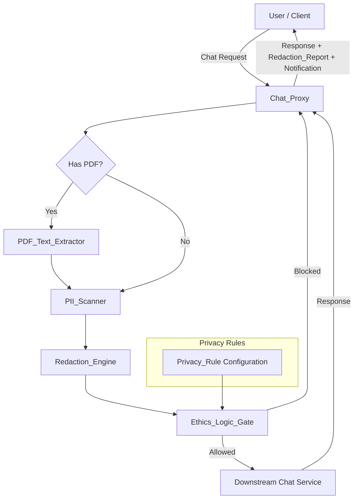

# Privacy Lens

Privacy Lens is a TypeScript middleware that sits between the user and any downstream AI chat service. Every message passes through a real-time pipeline before it ever leaves the browser.

## Architecture

The system is a synchronous pipeline orchestrated by a Chat Proxy:

```
Request → PDF Extraction (if attached) → PII Scan → Redaction → Ethics Logic Gate → Downstream Service
```




## Supported PII Types

- Email addresses (RFC 5322 simplified)
- US phone numbers — `(XXX) XXX-XXXX`, `XXX-XXX-XXXX`, `+1XXXXXXXXXX`
- Social Security Numbers — `XXX-XX-XXXX`, `XXXXXXXXX`
- Credit card numbers — 13–19 digits with optional spaces/dashes
- Physical mailing addresses
- File system paths — Unix absolute, home-relative (`~/`), Windows drive (`C:\`), and UNC (`\\server\share`)


## Components

| Component | Responsibility |
|---|---|
| PII_Scanner | Regex-based detection of PII entities in text |
| Redaction_Engine | Replaces PII with type-specific placeholders (e.g. `[EMAIL_REDACTED]`) |
| Ethics_Logic_Gate | Evaluates privacy rules — blocks or allows messages |
| Notification_Service | Builds user-facing notifications about actions taken |
| PDF_Text_Extractor | Extracts text from PDF attachments (via `pdf-parse`) |
| Chat_Proxy | Orchestrates the pipeline and generates audit reports |

